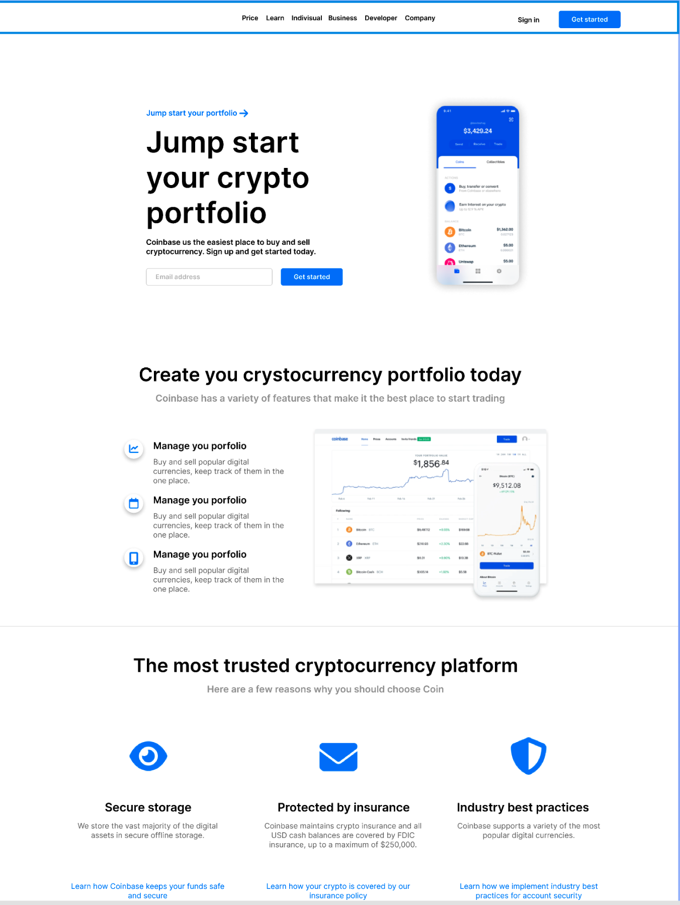
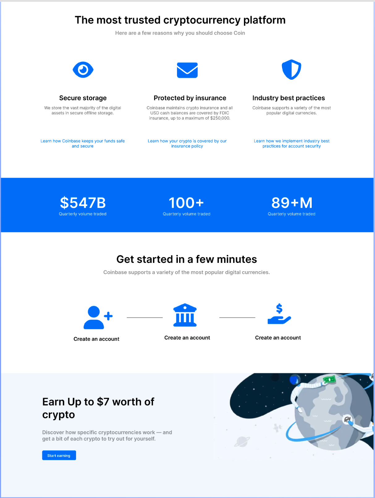
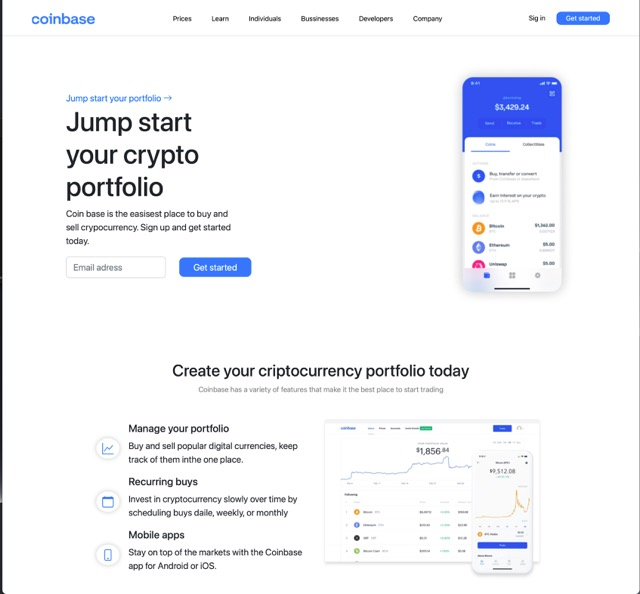
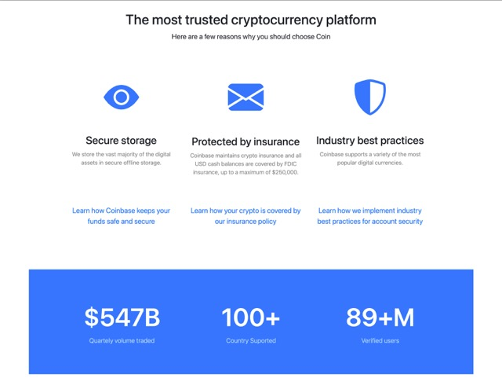
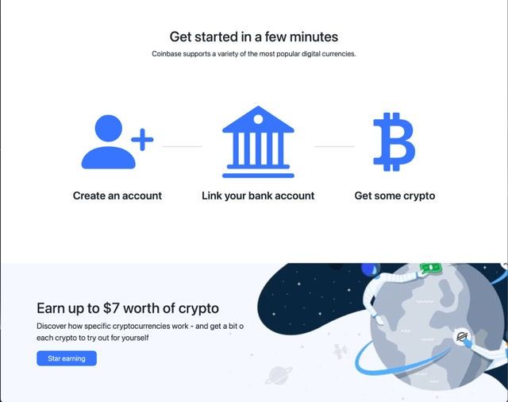

# OpenBootCamp-HTML-CSS-Final-Project

This is the final proyect for the OpenBootCamp Campus. The inspiration is a [Figma Design](<https://www.figma.com/file/fJc2aGVMk0snfBw8TSOwm4/coinbase---crypto-website-design-(Community)-(Community)-(Community)?node-id=0%3A1>).

## Technologies:

- Basic HTML
- CSS + SASS
- Flexbox
- Media Query
- Bootstrap Grid
- Bootstrap Icons

## Template

## Links

- Live Site URL: [https://shiny-marshmallow-d22b39.netlify.app](https://shiny-marshmallow-d22b39.netlify.app)

## What I learned

It's been a month of study on the online campus. This was a fun proyect! Enjoy every step. Love the color palette and the icons.
Thanks to the teacher for giving us the complete mental and practical process to develop a project applicable to the real world.

## The final result

## Author

- Website - [crRoG](https://crRog.com)
- Frontend Mentor - [@crRoG](https://www.frontendmentor.io/profile/crRoG)
